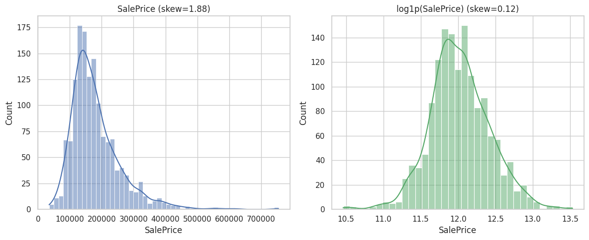
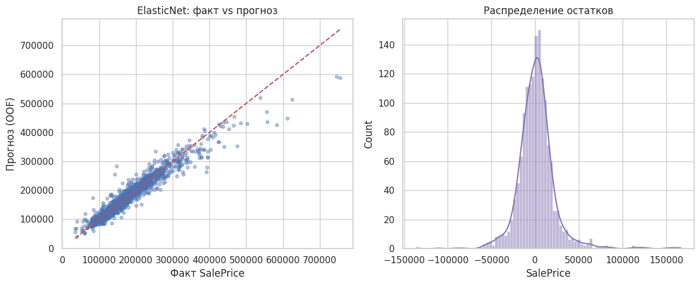
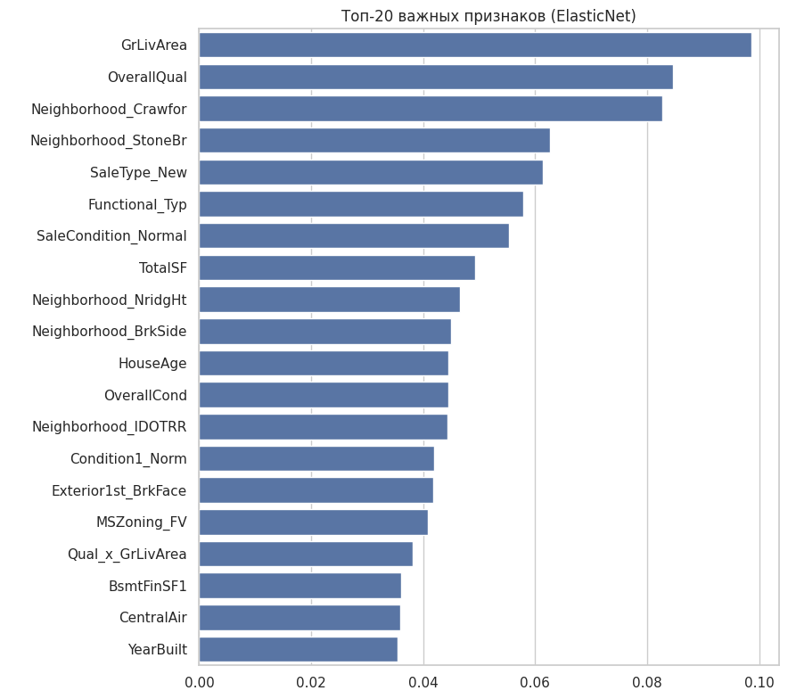

# Предсказание цен на дома: House Prices (Kaggle)

Проект по данным соревнования Kaggle [House Prices: Advanced Regression Techniques](https://www.kaggle.com/competitions/house-prices-advanced-regression-techniques): по 79 характеристикам дома в городе Эймс (Айова, США) предсказать цену продажи `SalePrice`.

[](https://colab.research.google.com/github/FDB1228/house_prices/blob/main/notebooks/house_prices.ipynb)

**Коротко:**

- лучшая одиночная модель: **ElasticNet**, RMSE на `log(SalePrice)` (метрика соревнования, RMSLE) **0,1141** на 5-fold кросс-валидации;
- на out-of-fold предсказаниях это около **22 тыс. долларов** средней квадратичной ошибки, **R² = 0,924**;
- регуляризованные линейные модели (ElasticNet, Lasso, Ridge) оказались точнее градиентных бустингов и случайного леса;
- итоговый `submission.csv` — усреднение предсказаний Ridge, Lasso и ElasticNet.

## О задаче

- **Задача:** регрессия. Нужно предсказать `SalePrice` в долларах.
- **Метрика:** RMSLE, то есть RMSE между логарифмами предсказанной и фактической цены. Ошибка считается в относительных величинах: промах в 10 % одинаково «весит» для дома за 100 тыс. и за 1 млн. Поэтому модели обучаются на `log1p(SalePrice)`.
- **Признаки трёх типов:** числовые (площади, годы, число комнат), порядковые (оценки качества `Po < Fa < TA < Gd < Ex`) и номинальные (район, тип крыши, стиль дома).
- **Особенность данных:** `NA` в ряде признаков означает «этого элемента нет» (например, нет бассейна или гаража), а не «значение потеряно». С такими пропусками и со случайно потерянными значениями нужно работать по-разному.

## Данные

|                                    | train             | test    |
| ---------------------------------- | ----------------- | ------- |
| Строк (домов)                      | 1460              | 1459    |
| Строк после удаления выбросов      | 1458              | 1459    |
| Исходных признаков                 | 79 (+ `Id`, цена) | 79      |

- Признаков с пропусками: 34 (самые «пустые»: `PoolQC` 99,7 %, `MiscFeature` 96,4 %, `Alley` 93,2 %, `Fence` 80,4 %).
- Удалены 2 выброса: дома с `GrLivArea > 4000` кв. футов, проданные дешевле 300 000 $.
- После feature engineering признаков стало 92, после one-hot кодирования 245.

Сильнее всего с ценой коррелируют `OverallQual` (0,80), `GrLivArea` (0,73), `TotalBsmtSF` (0,65), `GarageCars` (0,64).



Цена скошена вправо (асимметрия 1,88). После `log1p` распределение становится близким к нормальному (асимметрия 0,12).

## Что сделано

1. **EDA:** распределение целевой переменной, корреляции с ценой, анализ пропусков.
2. **Очистка:** удаление двух выбросов; пропуски заполнены по смыслу признака: категория `None` там, где элемента нет; `0` для площадей и количеств отсутствующих элементов; медиана по району для `LotFrontage`; мода для единичных пропусков в категориях. Исправлена опечатка в данных (`GarageYrBlt = 2207`).
3. **Кодирование:** порядковые шкалы качества закодированы числами с сохранением порядка, `MSSubClass`, `MoSold` и `YrSold` переведены в категории, остальные категории обработаны через one-hot (`drop_first=True`).
4. **Feature engineering:** `TotalSF`, `TotalBath`, `TotalPorchSF`, возраст дома, ремонта и гаража, бинарные флаги (`HasPool`, `Has2ndFloor`, `HasGarage`, `HasBsmt`, `HasFireplace`, `IsRemodeled`), произведения качества на площадь.
5. **Преобразования:** Box-Cox (`boxcox1p`, λ = 0,15) для 38 признаков с асимметрией больше 0,75 по модулю; `RobustScaler`, обученный на train.
6. **Модели и подбор гиперпараметров** на одних и тех же 5 фолдах: Ridge, Lasso, ElasticNet (`GridSearchCV`), Random Forest, Gradient Boosting, XGBoost, LightGBM (`RandomizedSearchCV`, 25–30 итераций).
7. **Диагностика лучшей модели:** out-of-fold предсказания, график «факт против прогноза», остатки, важность признаков.
8. **Ансамбль:** простое усреднение топ-3 моделей по CV в логарифмической шкале, обратное преобразование через `expm1`, файл `submission.csv`.

## Результаты

RMSE на `log(SalePrice)`, 5-fold кросс-валидация (меньше — лучше):

| Модель            | RMSE        | Лучшие параметры                                                        |
| ----------------- | ----------- | ----------------------------------------------------------------------- |
| **ElasticNet**    | **0,11406** | `alpha=0.005`, `l1_ratio=0.1`                                           |
| Lasso             | 0,11407     | `alpha=0.0007`                                                          |
| Ridge             | 0,11425     | `alpha=15`                                                              |
| XGBoost           | 0,11559     | `n_estimators=500`, `max_depth=4`, `learning_rate=0.05`, `subsample=0.6` |
| Gradient Boosting | 0,11681     | `n_estimators=1200`, `max_depth=3`, `learning_rate=0.03`, `subsample=0.6` |
| LightGBM          | 0,11853     | `n_estimators=1500`, `num_leaves=15`, `learning_rate=0.01`              |
| Random Forest     | 0,13069     | `n_estimators=600`, `max_features=0.5`, `min_samples_leaf=2`            |

Лучшая модель (ElasticNet) на out-of-fold предсказаниях: RMSE **21 952 $**, R² **0,9237**.

Что видно по результатам:

- Три линейные модели с регуляризацией практически равны между собой (разница не больше 0,0002) и лучше всех бустингов. Возможное объяснение, которое в проекте не проверялось: после логарифмирования, Box-Cox и добавленных признаков зависимости стали близки к линейным, а данных всего около 1,5 тыс. строк.
- Случайный лес заметно отстаёт от всех остальных моделей.
- На графике «факт против прогноза» видно, что модель **занижает цену самых дорогих домов** (от 400 тыс. и выше): точки лежат ниже диагонали. В основной массе (до 300 тыс.) прогнозы близки к факту, а остатки сосредоточены около нуля, хотя у распределения остатков есть заметные хвосты.



### Какие признаки важны

Для ElasticNet важность оценивалась по модулю коэффициентов (признаки масштабированы, поэтому коэффициенты сопоставимы). В топе площадь `GrLivArea`, общее качество `OverallQual`, суммарная площадь `TotalSF`, возраст дома `HouseAge`, а также несколько районов (`Neighborhood_Crawfor`, `Neighborhood_StoneBr`, `Neighborhood_NridgHt`) и признаки условий продажи (`SaleType_New`, `SaleCondition_Normal`). Для редких dummy-признаков (отдельные районы) модуль коэффициента даёт лишь грубую оценку важности.



Остальные графики: [корреляции с ценой](reports/figures/correlation_heatmap.png) и [пропуски по признакам](reports/figures/missing_values.png).

## Ограничения

- **CV-оценка немного оптимистична.** Гиперпараметры подбирались на тех же 5 фолдах, на которых показана метрика (вложенной кросс-валидации нет). Результат на скрытом тесте Kaggle может быть хуже.
- **Предобработка вынесена за пределы кросс-валидации.** Масштабирование, отбор скошенных признаков и заполнение пропусков медианами выполнены один раз на объединённой таблице train и test (без использования цены). Метки теста не используются, но строго корректнее делать это внутри `Pipeline` на каждом фолде.
- **Ансамбль не оценивался отдельно.** В него входят три линейные модели, которые устроены похоже, поэтому выигрыш от усреднения, скорее всего, небольшой.
- **Занижение цен дорогих домов** (см. график остатков выше).

## Структура репозитория

```
.
├── notebooks/
│   └── house_prices.ipynb         # основной ноутбук
├── reports/
│   └── figures/                   # графики из ноутбука для README
├── README.md
├── requirements.txt
└── .gitignore
```

## Данные в репозиторий не включены

Скачайте их на [странице соревнования](https://www.kaggle.com/competitions/house-prices-advanced-regression-techniques/data) после принятия правил. Нужны файлы `train.csv` и `test.csv`. Через Kaggle CLI:

```bash
kaggle competitions download -c house-prices-advanced-regression-techniques
```

## Как запустить

**В Google Colab**

1. Загрузите `train.csv` и `test.csv` в папку на Google Drive.
2. Откройте ноутбук по кнопке Colab вверху.
3. В ячейке настроек (раздел с `DATA_DIR`) укажите путь к этой папке.
4. Выполните `Runtime → Run all`. Файл `submission.csv` появится в рабочей папке Colab.

**Локально**

```bash
git clone https://github.com/FDB1228/house_prices.git
cd House_prices
python -m venv .venv
source .venv/bin/activate        # Windows: .venv\Scripts\activate
pip install -r requirements.txt
mkdir data                       # положите train.csv и test.csv в data/
jupyter lab notebooks/house_prices.ipynb
```

Локально ноутбук ищет данные в папке `data/` в корне репозитория. XGBoost и LightGBM необязательны: если их нет, ноутбук пропустит эти модели.

## Стек

Python, pandas, NumPy, SciPy, scikit-learn, XGBoost, LightGBM, matplotlib, seaborn.

## Что можно улучшить

- Собрать предобработку и модель в `sklearn.Pipeline` и считать кросс-валидацию так, чтобы масштабирование и заполнение пропусков обучались на каждом фолде отдельно.
- Оценить подбор гиперпараметров через вложенную кросс-валидацию.
- Оценить ансамбль на out-of-fold предсказаниях и сделать его разнообразнее: добавить в усреднение или стекинг бустинги, а не только линейные модели.
- Разобраться с занижением цен дорогих домов: отдельные признаки для верхнего ценового сегмента, взвешивание наблюдений или модель, устойчивая к хвосту.
- Целевое кодирование района вместо one-hot.
